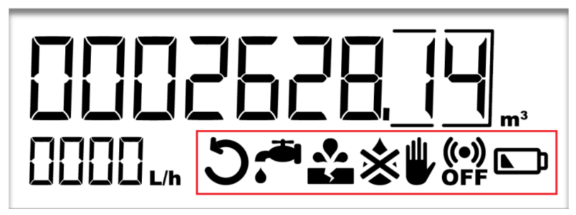
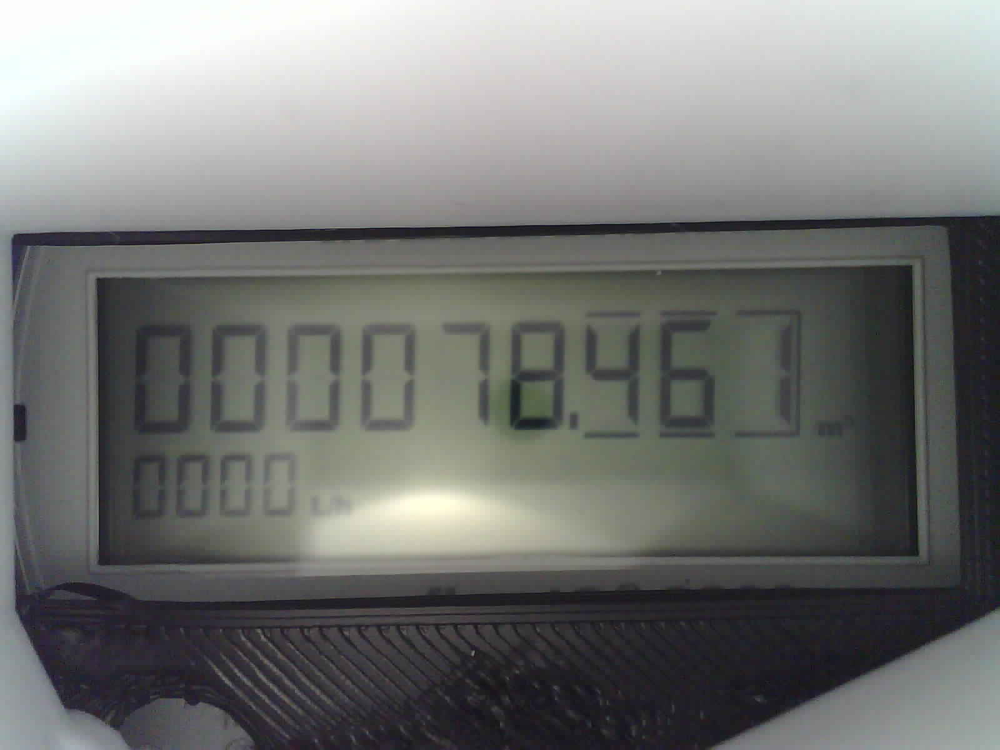

# SegmentedDisplays

[](https://tp2750.github.io/SegmentedDisplays.jl/stable)
[](https://tp2750.github.io/SegmentedDisplays.jl/dev)
[](https://github.com/tp2750/SegmentedDisplays.jl/actions/workflows/CI.yml?query=branch%3Amain)
[](https://codecov.io/gh/tp2750/SegmentedDisplays.jl)

## Purpose

The objective of this project is to be able to read the display of a [FlowIQ2200](https://www.kamstrup.com/en-en/water-solutions/meters-devices/meters/flowiq-2200-eu) water-meter using a [ESP32-cam](https://www.arducam.com/esp32-machine-vision-learning-guide/) module.

## Input

Ideally the viewing area of the display looks like this:



In practice, we can take images like this:



## Status

Right now, I can load am image together with a description of where the active areas are, and parse the value of the 7-segment areas:

```{julia}
using Revise, SegmentedDisplays, Images, FileIO, YAML, PrettyPrinting, Statistics, ImageDraw
dis = Display("images/cam-hi_2021-12-20_2130_1200x1600_display.yml");
img = load("images/cam-hi_2021-12-20_2130_1200x1600.jpg");
imshow(img)
display_call_digits!(dis, img; method="2points");
display_values(dis)

2×7 DataFrame
 Row │ area_name    value      decimal_power  contrast  state  int_val  result  
     │ String       String     Int64?         Float64?  Any    Int64    Float64 
─────┼──────────────────────────────────────────────────────────────────────────
   1 │ consumption  000078461              3  0.172549  on       78461   78.461
   2 │ flow         0000                   0  0.0       none         0    0.0
```

## Nomenclaure

Some useful terms when talking about LCD-displays:  https://www.pacificdisplay.com/lcd_glossary.htm

- Viewing Area: 	The area of a display which is visible through a bezel or cut-out in an instrument. This area is made up of the "Active Area" and the boarder around the active area.
- Image Area: 	The total area bounded by the display characters
- Active Area: 	Area (L x H) of the LCD that has active segments.
- Segment: 	An active area within the display which can be turned on and off. This can be a single segment of a 7-segment character, an annunciator, or a pixel in a dot matrix array.
- Annunciator: 	A word or special symbol which is driven as a single segment
- Contrast Ratio: 	The ratio of the luminance between the dark and light areas of the display.
- Ghosting: 	A condition where segments which are in the "off" condition become slightly visible.
- Ink Overlay: 	The process of applying opaque, colored inks to the display to provide colors, or highlight certain areas of annunciators.

